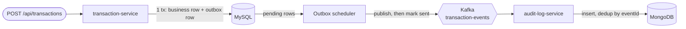

# Investment Platform Sim

[](https://github.com/tdutra-dev/investment-platform-sim/actions/workflows/ci.yml)

Personal portfolio project built to practice event-driven microservices. It simulates an investment platform. Customers and transactions are managed by two Spring Boot services; every state change is published to Kafka through a Transactional Outbox and stored by a third service as an audit trail in MongoDB.

## Architecture

| Service | Port | DB | Role |
|---|---|---|---|
| `customer-service` | 8081 | MySQL | Customer management (DDD: `Customer` is the aggregate root), publishes `customer-events` via outbox |
| `transaction-service` | 8082 | MySQL | Transaction processing (business rule: no negative balance), publishes `transaction-events` via Transactional Outbox |
| `audit-log-service` | 8083 | MongoDB | Kafka consumer of both topics, idempotent event log, query API |



`customer-service` follows the same outbox flow on the `customer-events` topic.

## Design decisions

- **Transactional Outbox, no dual write.** The business row and the event row are written in the same DB transaction; a scheduler publishes pending rows to Kafka and marks them as sent only after the broker ack. Nothing is sent to Kafka from inside the business transaction, so a crash can never leave a committed change without its event (or vice versa). Delivery is at-least-once.
- **MongoDB for the audit log.** Events are append-only, schema-flexible documents that are stored verbatim and queried by `aggregateId`; no joins or relational constraints are needed.
- **Idempotent consumer.** Every event carries an `eventId`, which the audit-log service uses as the document `_id`. Redelivered events hit a duplicate key and are ignored, so at-least-once delivery produces exactly one audit entry.

## Outbox strategy

Both `transaction-service` and `customer-service` use the shared `outbox-common` module.

- **Claiming:** each scheduler run opens one transaction and claims a batch with `SELECT ... FOR UPDATE SKIP LOCKED` (MySQL 8.4). Several instances can run against the same table without publishing a row twice: a row locked by one instance is skipped by the others.
- **States:** `PENDING` -> `SENT` after the broker ack. A failed publish increments `attempts`, stores `last_error` and sets `next_attempt_at` with exponential backoff; after the max attempts the row becomes `FAILED` (kept for inspection, never retried automatically).
- **Cleanup:** a second job deletes `SENT` rows older than the retention period.
- **Configuration** (per service, `application.properties`): `outbox.batch-size` (50), `outbox.max-attempts` (5), `outbox.backoff.initial` (1s), `outbox.backoff.max` (5m), `outbox.retention` (7d), `outbox.publisher.fixed-delay-ms` (5000), `outbox.cleanup.fixed-delay-ms` (1h).
- **Remaining limits:** delivery is at-least-once (a crash after the broker ack but before the commit re-sends the row; consumers deduplicate by `eventId`); there is no ordering guarantee across topics, and none across rows once retries are involved; a publish failure stops the current batch.

## Stack

Java 17, Spring Boot 3.3, Spring Data JPA (MySQL 8.4), Spring Data MongoDB (MongoDB 7), Spring Kafka, JUnit 5, Mockito, Testcontainers.

## Quick start

Requirements: JDK 17, Maven 3.9+, Docker.

```bash
# 1. Infrastructure: MySQL, MongoDB, Kafka
docker compose up -d

# 2. Build all modules and run all tests (unit + Testcontainers + end-to-end).
#    Needs Docker running; takes a few minutes (container startup + end-to-end test).
mvn clean verify

# 3. Run the services (one terminal each)
java -jar customer-service/target/customer-service-0.0.1-SNAPSHOT.jar
java -jar transaction-service/target/transaction-service-0.0.1-SNAPSHOT.jar
java -jar audit-log-service/target/audit-log-service-0.0.1-SNAPSHOT.jar
```

Host ports are configurable. If a local MySQL, MongoDB or Kafka already uses a default port, copy `.env.example` to `.env`, change `MYSQL_PORT`, `MONGO_PORT` or `KAFKA_PORT`, and export the same variables before starting the services (`set -a; source .env; set +a`). `docker compose` reads `.env` automatically.

Try it:

```bash
# customer-service
curl -X POST localhost:8081/api/customers -H 'Content-Type: application/json' \
  -d '{"name":"Ada Lovelace","email":"ada@example.com"}'

# transaction-service (use the customer id returned above)
curl -X POST localhost:8082/api/transactions -H 'Content-Type: application/json' \
  -d '{"customerId":"<customer-id>","amount":250.00,"currency":"EUR","type":"DEPOSIT"}'

# audit-log-service (use the transaction id or customer id; allow ~5 s for the outbox scheduler)
curl 'localhost:8083/api/audit-log?aggregateId=<id>'
```

Other endpoints: `GET /api/customers/{id}`, `GET /api/transactions/{id}`, `GET /api/transactions?customerId=...`.

## Tests

- Unit tests (JUnit 5 + Mockito): domain and service logic, outbox scheduler, idempotent consumer.
- Testcontainers integration tests: MySQL repository, outbox → Kafka round trip, two concurrent outbox instances publishing every event exactly once, MongoDB repository.
- End-to-end (`e2e-tests`, failsafe): starts the three packaged services against MySQL, Kafka and MongoDB containers, creates a customer and a transaction over REST and asserts both events are stored in MongoDB.

## Known trade-offs

At-least-once delivery, made safe by idempotency via `eventId`; no ordering guarantee across topics.

## Limitations and next steps

- `FAILED` outbox rows are not retried automatically and there is no alerting or admin endpoint for them yet.
- No authentication, no Dockerfiles, no observability (metrics, tracing).

## Development status

| Phase | Description | Status |
|---|---|---|
| 0 | Scaffolding: 3 Spring Boot services + Docker Compose | ✅ Done |
| 1 | `customer-service`: domain, repository, service, REST, unit tests | ✅ Done |
| 2 | `transaction-service`: domain with business rule, REST, unit tests | ✅ Done |
| 3 | Transactional Outbox + Kafka publisher (transaction and customer events) | ✅ Done |
| 4 | `audit-log-service`: Kafka consumer, idempotent MongoDB persistence, query API | ✅ Done |
| 5 | Testcontainers integration tests (MySQL, Kafka, MongoDB) | ✅ Done |
| 6 | End-to-end Testcontainers test + CI | ✅ Done |
| 7 | Outbox hardening: batch claiming with `SKIP LOCKED`, retry with backoff, cleanup, shared `outbox-common` module | In progress (waiting for green CI) |
| 8 | Dockerfiles for the services, authentication, observability | Planned |
